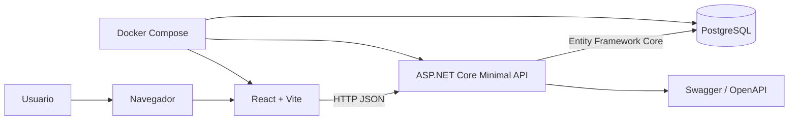

# 01 - Visao Geral

## Objetivo

O Projeto Renda Familiar é uma aplicação para controle de gastos residenciais. Ela centraliza o cadastro de pessoas, o registro de receitas e despesas e a consulta de totais por pessoa e total geral.

## Funcionalidades

- Cadastro e remoção de pessoas.
- Cadastro de transações de receita ou despesa.
- Listagem de pessoas e transações.
- Cálculo de receitas, despesas e saldo por pessoa.
- Cálculo de receitas, despesas e saldo geral.
- Validações de negócio na API.

## Arquitetura geral

## Portas

| Serviço | Porta local | Observação |
| --- | ---: | --- |
| Web | 5173 | React servido pelo Vite ou Nginx |
| API | 5044 | Minimal API e Swagger |
| PostgreSQL | 5434 | Banco local exposto pelo Docker Compose |

## Documentos

- [[02 - Arquitetura]]
- [[03 - Modelo de Dados]]
- [[04 - Fluxos]]
- [[05 - Regras de Negocio]]
