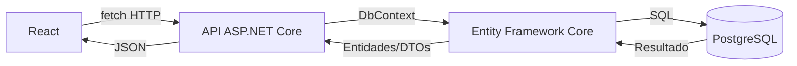
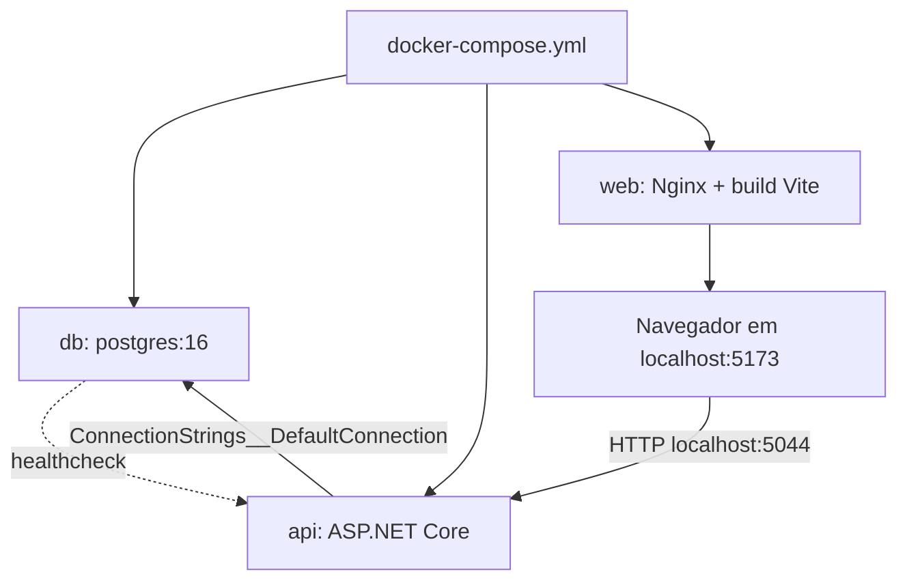
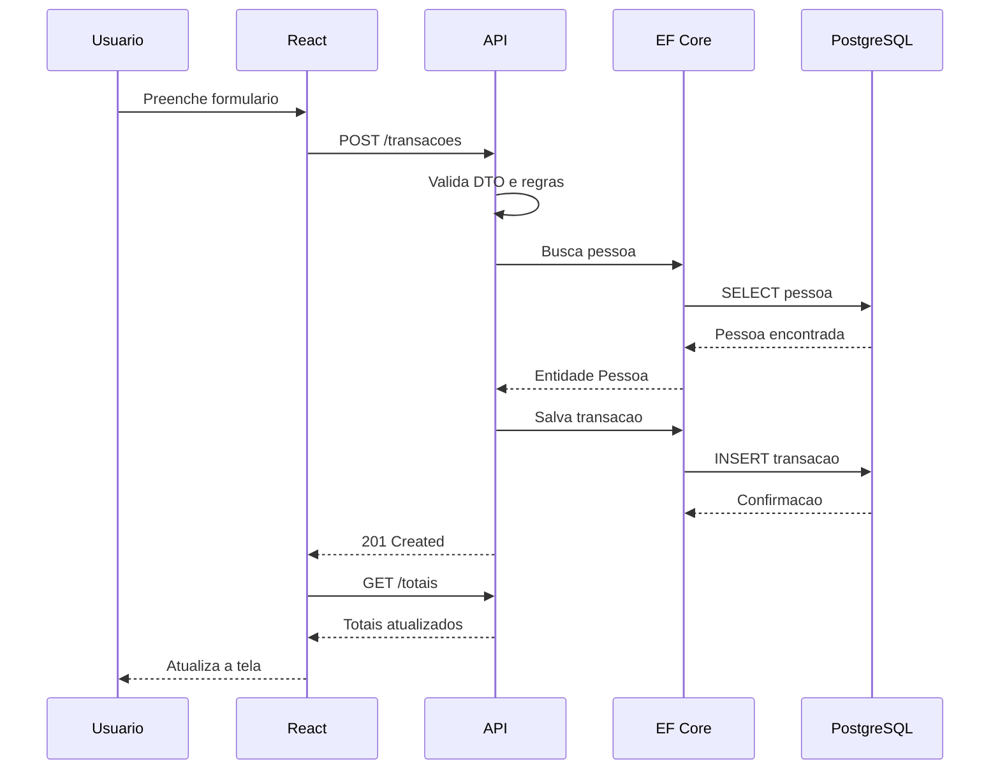
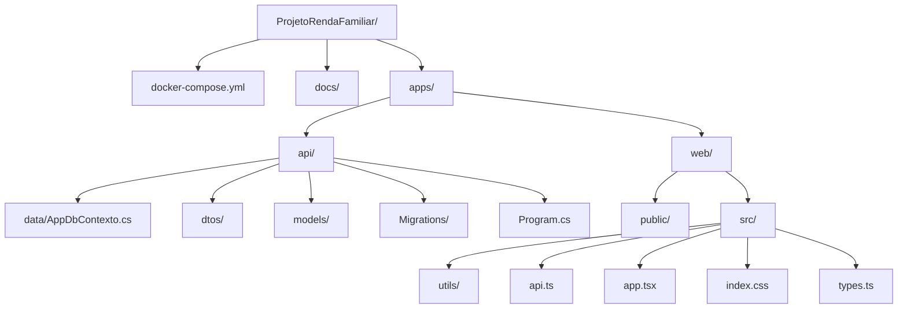

# 02 - Arquitetura

## Componentes

- `apps/web`: front-end React com TypeScript e Vite.
- `apps/api`: API ASP.NET Core 8 com Minimal API.
- `apps/api/data`: contexto do Entity Framework Core.
- `apps/api/models`: entidades do domínio.
- `apps/api/dtos`: contratos de entrada e saída.
- `apps/api/Migrations`: migrations do banco.
- `docker-compose.yml`: orquestra PostgreSQL, API e web.

## Fluxo HTTP

## Fluxo do Docker

## Sequência de uma requisição

## Estrutura das pastas

