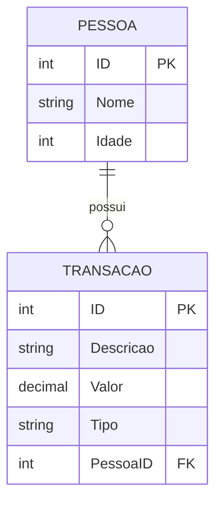
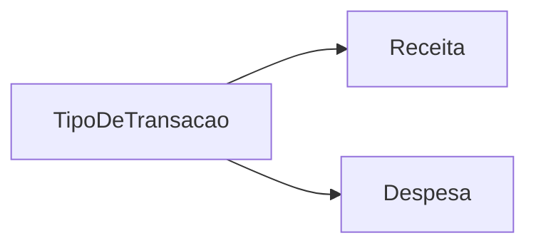

# 03 - Modelo de Dados

## Entidades

### Pessoa

Representa uma pessoa cadastrada na residência.

| Campo | Tipo | Regra |
| --- | --- | --- |
| `ID` | `int` | Chave primária |
| `Nome` | `string` | Obrigatório |
| `Idade` | `int` | Não pode ser negativa |
| `Transacoes` | `List<Transacao>` | Relacionamento 1:N |

### Transacao

Representa uma receita ou despesa vinculada a uma pessoa.

| Campo | Tipo | Regra |
| --- | --- | --- |
| `ID` | `int` | Chave primária |
| `Descricao` | `string` | Obrigatória |
| `Valor` | `decimal` | Maior que zero |
| `Tipo` | `TipoDeTransacao` | `Receita` ou `Despesa` |
| `PessoaID` | `int` | Chave estrangeira |
| `Pessoa` | `Pessoa?` | Navegação EF Core |

## ER simplificado



## Enum



## Calculos

```text
TotalReceitasPessoa = soma das transacoes Receita da pessoa
TotalDespesasPessoa = soma das transacoes Despesa da pessoa
SaldoPessoa = TotalReceitasPessoa - TotalDespesasPessoa

TotalReceitasGeral = soma das receitas de todas as pessoas
TotalDespesasGeral = soma das despesas de todas as pessoas
SaldoLiquidoGeral = TotalReceitasGeral - TotalDespesasGeral
```

## Persistencia

O relacionamento `Pessoa -> Transacoes` usa exclusão em cascata. Quando uma pessoa é removida, as transações vinculadas também são removidas.
