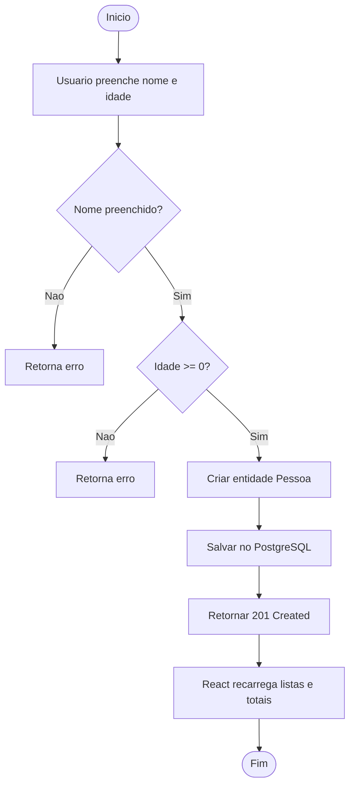
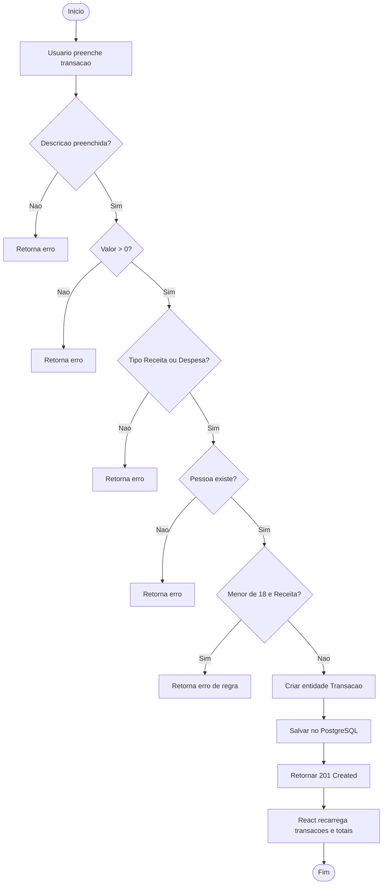
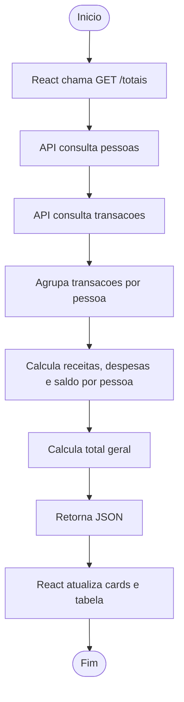
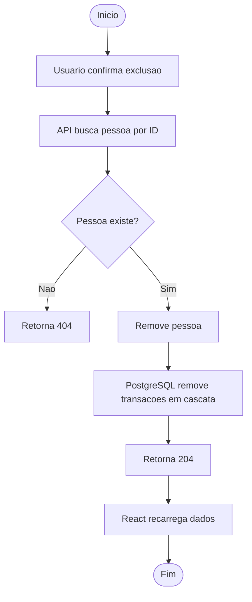

# 04 - Fluxos

## Cadastro de pessoas

```mermaid
flowchart TD
    Inicio([Inicio]) --> Form[Usuario preenche nome e idade]
    Form --> NomeValido{Nome preenchido?}
    NomeValido -- Nao --> ErroNome[Retorna erro]
    NomeValido -- Sim --> IdadeValida{Idade >= 0?}
    IdadeValida -- Nao --> ErroIdade[Retorna erro]
    IdadeValida -- Sim --> Criar[Criar entidade Pessoa]
    Criar --> Salvar[Salvar no PostgreSQL]
    Salvar --> Responder[Retornar 201 Created]
    Responder --> Atualizar[React recarrega listas e totais]
    Atualizar --> Fim([Fim])
```

## Cadastro de transacoes

```mermaid
flowchart TD
    Inicio([Inicio]) --> Form[Usuario preenche transacao]
    Form --> DescricaoValida{Descricao preenchida?}
    DescricaoValida -- Nao --> ErroDescricao[Retorna erro]
    DescricaoValida -- Sim --> ValorValido{Valor > 0?}
    ValorValido -- Nao --> ErroValor[Retorna erro]
    ValorValido -- Sim --> TipoValido{Tipo Receita ou Despesa?}
    TipoValido -- Nao --> ErroTipo[Retorna erro]
    TipoValido -- Sim --> PessoaExiste{Pessoa existe?}
    PessoaExiste -- Nao --> ErroPessoa[Retorna erro]
    PessoaExiste -- Sim --> MenorReceita{Menor de 18 e Receita?}
    MenorReceita -- Sim --> ErroRegra[Retorna erro de regra]
    MenorReceita -- Nao --> Criar[Criar entidade Transacao]
    Criar --> Salvar[Salvar no PostgreSQL]
    Salvar --> Responder[Retornar 201 Created]
    Responder --> Atualizar[React recarrega transacoes e totais]
    Atualizar --> Fim([Fim])
```

## Consulta de totais

```mermaid
flowchart TD
    Inicio([Inicio]) --> Request[React chama GET /totais]
    Request --> Pessoas[API consulta pessoas]
    Pessoas --> Transacoes[API consulta transacoes]
    Transacoes --> Agrupar[Agrupa transacoes por pessoa]
    Agrupar --> CalcularPessoa[Calcula receitas, despesas e saldo por pessoa]
    CalcularPessoa --> CalcularGeral[Calcula total geral]
    CalcularGeral --> Resposta[Retorna JSON]
    Resposta --> Tela[React atualiza cards e tabela]
    Tela --> Fim([Fim])
```

## Exclusao de pessoa

```mermaid
flowchart TD
    Inicio([Inicio]) --> Confirmar[Usuario confirma exclusao]
    Confirmar --> Buscar[API busca pessoa por ID]
    Buscar --> Existe{Pessoa existe?}
    Existe -- Nao --> NotFound[Retorna 404]
    Existe -- Sim --> Remover[Remove pessoa]
    Remover --> Cascata[PostgreSQL remove transacoes em cascata]
    Cascata --> NoContent[Retorna 204]
    NoContent --> Atualizar[React recarrega dados]
    Atualizar --> Fim([Fim])
```
